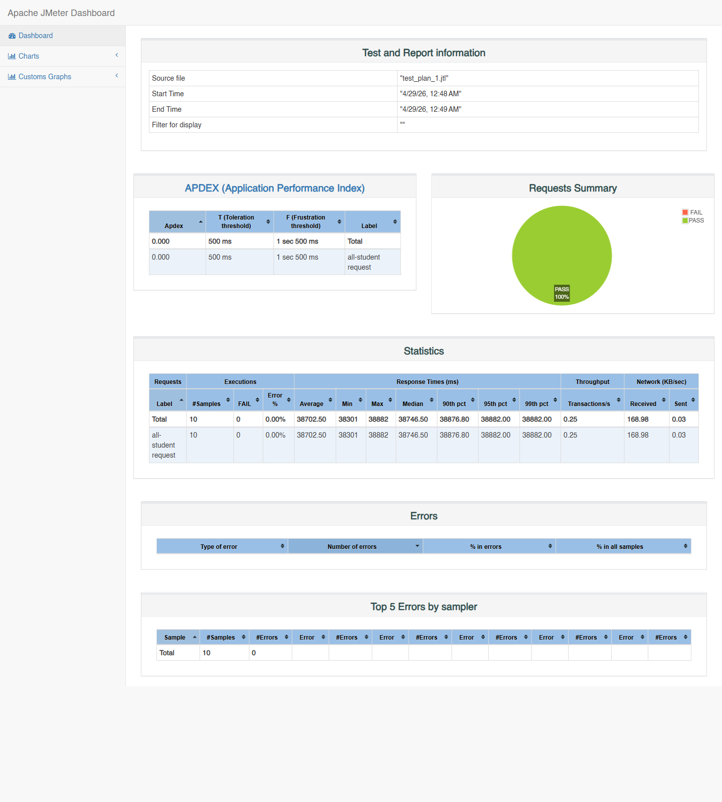
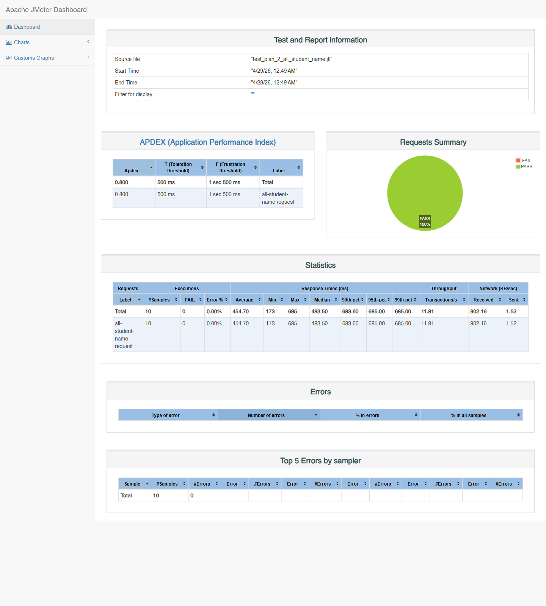
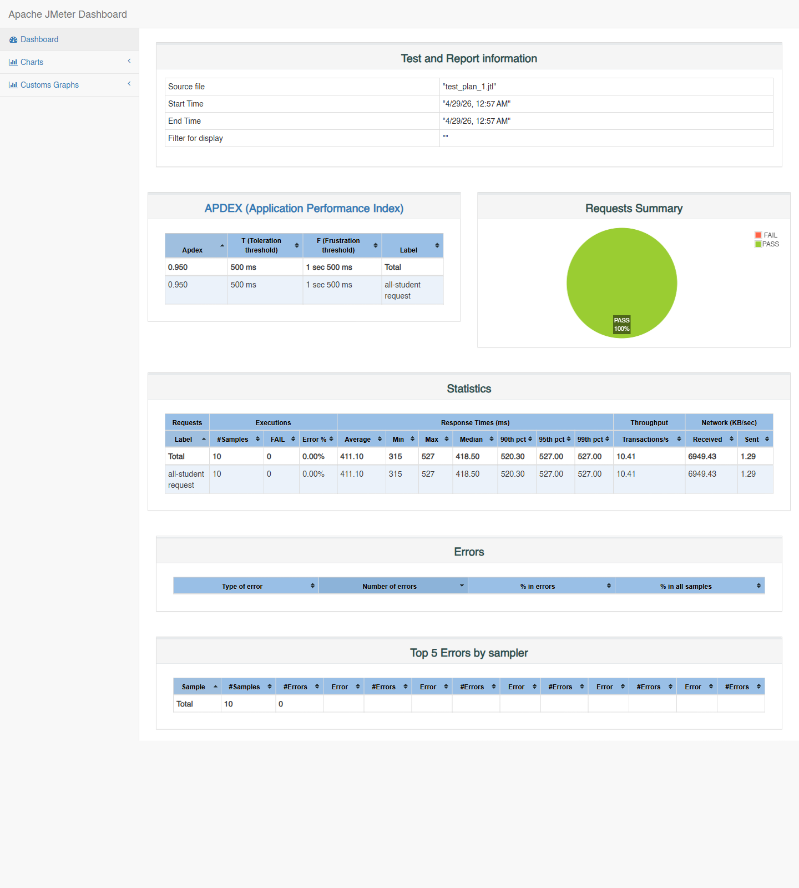

# Module 07 - Profiling

This repository contains the setup work, performance tests, profiling results, code optimization, and reflection for Module 07.

## Project Setup

1. Cloned the source code from the module repository.
2. Configured PostgreSQL connection in `application.properties` to a local dedicated instance on port `55432`.
3. Reduced the seeded student count from `20_000` to `5_000`. The module allows this when seeding takes too long, as long as the dataset is still large enough to expose performance issues.
4. Ran the app and verified the schema creation.
5. Seeded the data through:
   - `GET /seed-data-master`
   - `GET /seed-student-course`
6. Final seeded volume:
   - `students`: `5,000`
   - `courses`: `10`
   - `student_courses`: `10,000`

## Test Plans

The following JMeter plans were created:

- `test_plan_1.jmx` -> `GET /all-student`
- `test_plan_2_all_student_name.jmx` -> `GET /all-student-name`
- `test_plan_3_highest_gpa.jmx` -> `GET /highest-gpa`

Each plan uses:

- `10` users
- ramp-up `1` second
- `1` loop
- listeners:
  - `View Results Tree`
  - `View Results in Table`
  - `Summary Report`
  - `Graph Results`

## Measurement Method

Warm-up runs were executed before measurement so the first cold JVM run was not used as the reference point.

Profiling evidence was collected with Java Flight Recorder. The hotspots are the same runtime paths that would be visible from IntelliJ Ultimate through JFR-based profiling.

## Results

### Direct endpoint timing

| Endpoint | Before (s) | After (s) | Improvement |
| --- | ---: | ---: | ---: |
| `/all-student` | 20.197 | 0.194 | 99.04% |
| `/all-student-name` | 0.194 | 0.028 | 85.57% |
| `/highest-gpa` | 0.076 | 0.020 | 73.68% |

### JMeter average response time

| Endpoint | Before (ms) | After (ms) | Improvement |
| --- | ---: | ---: | ---: |
| `/all-student` | 38702.5 | 411.1 | 98.94% |
| `/all-student-name` | 454.7 | 75.5 | 83.40% |
| `/highest-gpa` | 186.3 | 71.9 | 61.41% |

All three endpoints exceed the required `20%` improvement threshold.

## Profiling Findings

### Before optimization

The main hotspot for `/all-student` was:

- `com.advpro.profiling.tutorial.service.StudentService.getAllStudentsWithCourses`

The dominant issue in the service layer was the N+1 query pattern:

1. load all students
2. run one query per student to load student courses
3. rebuild the response list in Java

Other inefficiencies found by code inspection and timing:

- `/highest-gpa` loaded all students and scanned them in memory
- `/all-student-name` concatenated strings repeatedly in a loop

### After optimization

After the refactor, `getAllStudentsWithCourses` was no longer the dominant hotspot. The remaining visible work shifted mostly to `StudentCourse.toString()` and response rendering, which is expected because the endpoint still returns a large string payload.

## Refactoring

### 1. `/all-student`

Before:

- `studentRepository.findAll()`
- `studentCourseRepository.findByStudentId(student.getId())` for every student
- manual `StudentCourse` reconstruction

After:

- added `StudentCourseRepository.findAllWithStudentAndCourse()`
- used `join fetch` to load `StudentCourse`, `Student`, and `Course` in one query
- returned the query result directly

### 2. `/highest-gpa`

Before:

- fetched all students
- scanned GPA in Java

After:

- added `StudentRepository.findFirstByOrderByGpaDesc()`
- delegated max GPA selection to the database

### 3. `/all-student-name`

Before:

- fetched all student entities
- concatenated strings with `+=` in a loop

After:

- added `StudentRepository.findAllNames()`
- fetched only the `name` column
- used `String.join(", ", ...)`

## JMeter Screenshots

### Baseline

#### `/all-student`

#### `/all-student-name`

#### `/highest-gpa`

### After optimization

#### `/all-student`

#### `/all-student-name`

#### `/highest-gpa`

## Conclusion

Yes, there is a clear improvement in JMeter measurements for all endpoints.

- `/all-student` improved the most because the main bottleneck was database access amplification from the N+1 query pattern.
- `/all-student-name` improved because the application now fetches only names and avoids repeated string reallocation.
- `/highest-gpa` improved because the database performs the ordering and limit more efficiently than loading all rows into Java.

## Reflection

### 1. What is the difference between performance testing with JMeter and profiling with IntelliJ Profiler?

JMeter measures the behavior that an external client sees under load: response time, throughput, error rate, and how the application behaves with concurrent users. Profiling focuses on what happens inside the JVM while the request is being processed: which methods consume CPU time, which parts allocate memory, and where the real bottlenecks are. JMeter tells me that a request is slow; profiling tells me why it is slow.

### 2. How does profiling help identify and understand weak points in the application?

Profiling narrows the search space. Instead of guessing, I can see which methods remain active during expensive requests. In this module, the profiler evidence pointed to `getAllStudentsWithCourses`, then the source code showed the N+1 query loop and unnecessary object reconstruction. That makes the optimization decision concrete and defensible.

### 3. Is IntelliJ Profiler effective for analyzing bottlenecks?

Yes. A sampling profiler is effective because it shows where execution time is actually spent during a real request path. In this case, the profiling result was enough to isolate the expensive service method and confirm that the hotspot moved after refactoring.

### 4. What are the main challenges in performance testing and profiling, and how do you overcome them?

The main challenges are getting stable measurements, avoiding cold-start noise, and separating infrastructure issues from code issues. I handle them by warming up the JVM first, keeping the dataset fixed across before/after runs, using the same JMeter plans for comparison, and validating profiler results against the actual source code.

### 5. What are the main benefits of using IntelliJ Profiler for application profiling?

The main benefits are faster hotspot discovery, better visibility into runtime behavior, and easier comparison before and after refactoring. It shortens the feedback loop because it connects a slow request directly to the responsible code path.

### 6. How do you handle inconsistent results between profiling and JMeter?

I treat them as complementary signals, not contradictions. JMeter reflects end-to-end latency and concurrency effects, while profiling reflects internal execution cost. If they differ, I rerun the test after warm-up, check data volume, examine I/O or database effects, and verify whether the bottleneck is CPU-bound, query-bound, or serialization-bound.

### 7. What strategies do you implement after analyzing performance testing and profiling results, and how do you ensure functionality is preserved?

I change the smallest thing that removes the dominant cost first. In this module that meant pushing filtering/ordering work to the database, eliminating the N+1 query pattern, and reducing unnecessary object and string work. To preserve functionality, I kept the endpoint contracts unchanged, rebuilt the application, reran tests, and compared before/after HTTP responses plus JMeter results on the same dataset.

## Commits

- `main`: `0b4a4a8` `[Setup] Configure local profiling environment and JMeter plans`
- `optimize`: `2acc9d3` `[Refactoring] Optimize student query paths for profiled endpoints`
- `optimize`: `e776694` `[Documentation] Record profiling results and performance comparison`
